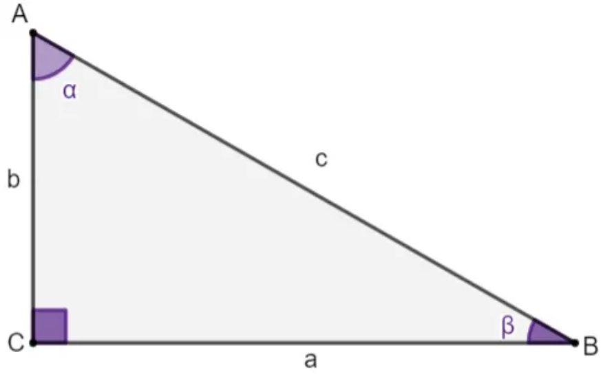

# Triângulo

## Relações Métricas no Triângulo Retângulo
- 
    - Fórmulas das relações:
        - $ {a}^2 = {b}^2 + {c}^2 $
        - $ {h}^2 = {m} . {n} $
        - $ {c}^2 = {h}^2 + {m}^2 $
        - $ {c}^2 = {a} . {m} $
        - $ {b}^2 = {h}^2 + {n}^2 $
        - $ {b}^2 = {a} . {n} $
        - $ {a} . {h} = {b} . {c} $
        - $ {a} = {m} + {n} $
    - Sendo:
        - $ A, B, C $ =: Vértices do triângulo retângulo
        - $ a $ =: hipotenusa do triângulo retângulo, oposta ao vértice A.
        - $ b $ =: um dos catetos do triângulo retângulo, oposto ao vértice B.
        - $ c $ =: o outro cateto do triângulo retângulo, oposto ao vértice C.
        - $ h $ =: a altura do triângulo retângulo em relação ao ângulo A
        - $ H $ =: projeção do vértice A sobre a hipotenusa do triângulo retângulo.
        - $ m $ =: projeção do cateto c sobre a hipotenusa do triângulo retângulo.
        - $ n $ =: projeção do cateto b sobre a hipotenusa do triângulo retângulo.
- Relações Trigonométricas no Triângulo Retângulo
- 
    - Fórmulas das relações:
        - $ \sin \alpha = \frac{\text{cateto oposto a}}{\text{hipotenusa c}}$
        - $ \sin \beta = \frac{\text{cateto oposto b}}{\text{hipotenusa c}}$
        - $ \cos \alpha = \frac{\text{cateto adjacente b}}{\text{hipotenusa c}}$
        - $ \cos \beta = \frac{\text{cateto adjacente a}}{\text{hipotenusa c}}$
        - $ \tg \alpha = \frac{\text{cateto oposto a}}{\text{cateto adjacente b}}$
        - $ \tg \beta = \frac{\text{cateto oposto b}}{\text{cateto adjacente a}}$
    - Inverso das relações:
        - $ \sec \alpha = \frac{1}{\cos \alpha }$
        - $ \sec \beta = \frac{1}{\cos \beta }$
        - $ \cosec \alpha = \frac{1}{\sin \alpha }$
        - $ \cosec \beta = \frac{1}{\sin \beta }$
        - $ \ctg \alpha = \frac{1}{\tg \alpha }$
        - $ \ctg \beta = \frac{1}{\tg \beta }$