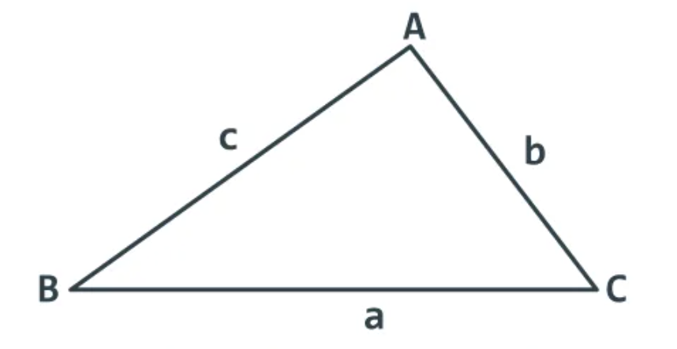

# Conceitos da Trigonometria

## Lei dos Senos
- 
    - $ \frac{\text{a}}{\sin \^{A}} = \frac{\text{b}}{\sin \^{B}} = \frac{\text{c}}{\sin \^{C}} $

## Lei dos Cossenos
- 
    - $ {a}^2 = {b}^2 + {c}^2 - 2 \, \text{b.c.} \cos \^{A} $
    - $ {b}^2 = {a}^2 + {c}^2 - 2 \, \text{a.c.} \cos \^{B} $
    - $ {c}^2 = {a}^2 + {b}^2 - 2 \, \text{a.b.} \cos \^{C} $
    - Sendo:
        - $ a, b, c $ =: lados de um triângulo qualquer
        - $ \^{A}, \^{B}, \^{C} $ =: ângulos de um triângulo qualquer

## Teorema das Áreas
- 
    - $ \text{Área do Triângulo} = \frac{\text{c.b.} \sin \^{CB}}{2} $
    - $ \text{Área do Triângulo} = \frac{\text{a.b.} \sin \^{AB}}{2} $
    - $ \text{Área do Triângulo} = \frac{\text{a.c.} \sin \^{AC}}{2} $
    - Sendo:
        - $ a, b, c $ =: lados de um triângulo qualquer
        - $ \^{AC}, \^{AB}, \^{CB} $ =: ângulos de um triângulo qualquer