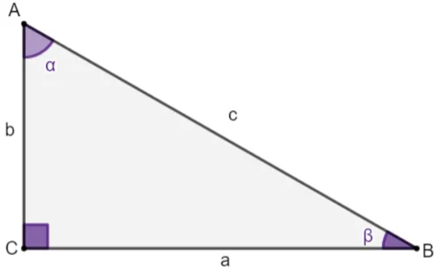
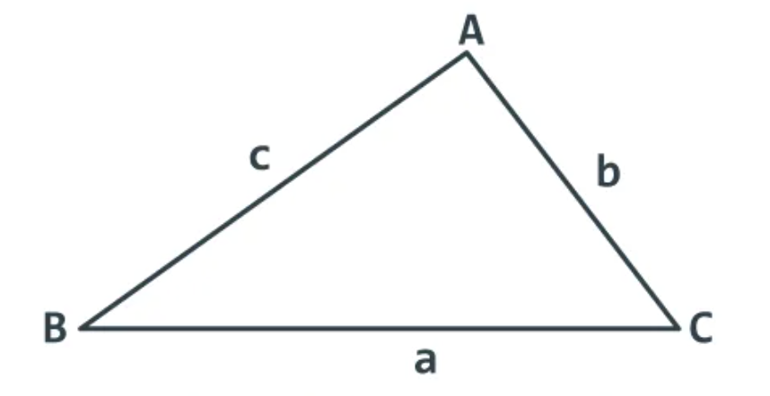

# Conceitos
- Deve-se perceber, no campo visual da geometria, a proximidade entre o real e o abstrato.
    - Deve-se perceber o uso da geometria na produção de imagens artísticas figurativas ou de imagens artísticas abstratas.
    - Como partir da modelagem de elementos abstratos da geometria para alcançar a visualização de imagens figurativas do real ou para alcançar imagens puramente abstratas?
- E deve-se perceber a interligação entre a Geometria e a Álgebra.
    - Como generalizar propriedades dos elementos abstratos da geometria usando a linguagem matemática da Álgebra?
    - Como vincular estes dois campos de estudo, para perceber estuturas matemáticas, sem o suporte da visualização?
    - Perceber que o suporte da visualização pode tornar a compreensão da geometria demasiadamente complexa. E perceber que o uso das estruturas matemáticas algébricas podem facilitar a compreensão da geometria.

## Teorema de Tales
- Se um feixe de retas paralelas é cortado por duas transversais, então dois segmentos de uma delas são proporcionais aos segmentos correpondentes da outra.

## Semelhança de Triângulos
- AA  (se dois ângulos dos dois triângulos são iguais)
- LLL (se os 3 lados dos dois triângulos possuem valores proporcionais)
- LAL (se dois lados dos dois triângulos, com um mesmo ângulo entre eles, possuem valores proporcionais)

## Teorema de Pitágoras
- Em um triângulo retângulo, o quadrado da hipotenusa é igual à soma do quadrado do primeiro cateto com o quadrado do segundo cateto.
- $ {h}^2 = {c_1}^2 + {c_2}^2 $
    - Sendo:
        - $ h $ =: hipotenusa do triângulo retângulo
        - $ c_1 $ =: um dos catetos do triângulo retângulo
        - $ c_2 $ =: o outro cateto do triângulo retângulo

## Relações Métricas no Triângulo Retângulo
- 
    - Fórmulas das relações:
        - $ {a}^2 = {b}^2 + {c}^2 $
        - $ {h}^2 = {m} . {n} $
        - $ {c}^2 = {h}^2 + {m}^2 $
        - $ {c}^2 = {a} . {m} $
        - $ {b}^2 = {h}^2 + {n}^2 $
        - $ {b}^2 = {a} . {n} $
        - $ {a} . {h} = {b} . {c} $
        - $ {a} = {m} + {n} $
    - Sendo:
        - $ A, B, C $ =: Vértices do triângulo retângulo
        - $ a $ =: hipotenusa do triângulo retângulo, oposta ao vértice A.
        - $ b $ =: um dos catetos do triângulo retângulo, oposto ao vértice B.
        - $ c $ =: o outro cateto do triângulo retângulo, oposto ao vértice C.
        - $ h $ =: a altura do triângulo retângulo em relação ao ângulo A
        - $ H $ =: projeção do vértice A sobre a hipotenusa do triângulo retângulo.
        - $ m $ =: projeção do cateto c sobre a hipotenusa do triângulo retângulo.
        - $ n $ =: projeção do cateto b sobre a hipotenusa do triângulo retângulo.
- Relações Trigonométricas no Triângulo Retângulo
- 
    - Fórmulas das relações:
        - $ \sin \alpha = \frac{\text{cateto oposto a}}{\text{hipotenusa c}}$
        - $ \sin \beta = \frac{\text{cateto oposto b}}{\text{hipotenusa c}}$
        - $ \cos \alpha = \frac{\text{cateto adjacente b}}{\text{hipotenusa c}}$
        - $ \cos \beta = \frac{\text{cateto adjacente a}}{\text{hipotenusa c}}$
        - $ \tg \alpha = \frac{\text{cateto oposto a}}{\text{cateto adjacente b}}$
        - $ \tg \beta = \frac{\text{cateto oposto b}}{\text{cateto adjacente a}}$
    - Inverso das relações:
        - $ \sec \alpha = \frac{1}{\cos \alpha }$
        - $ \sec \beta = \frac{1}{\cos \beta }$
        - $ \cosec \alpha = \frac{1}{\sin \alpha }$
        - $ \cosec \beta = \frac{1}{\sin \beta }$
        - $ \ctg \alpha = \frac{1}{\tg \alpha }$
        - $ \ctg \beta = \frac{1}{\tg \beta }$
        
## Lei dos Senos
- 
    - $ \frac{\text{a}}{\sin \^{A}} = \frac{\text{b}}{\sin \^{B}} = \frac{\text{c}}{\sin \^{C}} $

## Lei dos Cossenos
- 
    - $ {a}^2 = {b}^2 + {c}^2 - 2 \, \text{b.c.} \cos \^{A} $
    - $ {b}^2 = {a}^2 + {c}^2 - 2 \, \text{a.c.} \cos \^{B} $
    - $ {c}^2 = {a}^2 + {b}^2 - 2 \, \text{a.b.} \cos \^{C} $
    - Sendo:
        - $ a, b, c $ =: lados de um triângulo qualquer
        - $ \^{A}, \^{B}, \^{C} $ =: ângulos de um triângulo qualquer

## Teorema das Áreas
- 
    - $ \text{Área do Triângulo} = \frac{\text{c.b.} \sin \^{CB}}{2} $
    - $ \text{Área do Triângulo} = \frac{\text{a.b.} \sin \^{AB}}{2} $
    - $ \text{Área do Triângulo} = \frac{\text{a.c.} \sin \^{AC}}{2} $
    - Sendo:
        - $ a, b, c $ =: lados de um triângulo qualquer
        - $ \^{AC}, \^{AB}, \^{CB} $ =: ângulos de um triângulo qualquer

## Arco
- Conjunto de pontos de uma circunferência, compreendidos entre dois pontos extremos.
- Medido em radianos
- 1 radiano é igual ao comprimento de um raio da circunferência.
- Arcos múltiplos de π/4 rad
    - 0 rad = 0º
    - π/4 rad = 45º
    - 2 π/4 rad = 90º
    - 3 π/4 rad = 135º
    - 4 π/4 rad = 180º
    - 5 π/4 rad = 225º
    - 6 π/4 rad = 270º
    - 7 π/4 rad = 315º
    - 8 π/4 rad = 360º
- Arcos Múltiplos de π/6 rad
    - 0 rad = 0º
    - π/6 rad = 30º
    - 2 π/6 rad = 60º
    - 3 π/6 rad = 90º
    - 4 π/6 rad = 120º
    - 5 π/6 rad = 150º
    - 6 π/6 rad = 180º
    - 7 π/6 rad = 210º
    - 8 π/6 rad = 240º
    - 9 π/6 rad = 270º
    - 10 π/6 rad = 300º
    - 11 π/6 rad = 330º
    - 12 π/6 rad = 360º

## Ângulo
- Área interna entre dois segmentos que formam o ângulo.
- Medido em graus
- Angulos múltiplos de 45º:
    - 0º
    - 45º
    - 90º
    - 135º
    - 180º
    - 225º
    - 270º
    - 315º
    - 360º
- Angulos múltiplos de 30º:
    - 0º
    - 30º
    - 60º
    - 90º
    - 120º
    - 150º
    - 180º
    - 210º
    - 240º
    - 270º
    - 300º
    - 330º
    - 360º

## Reduções do Seno ao Primeiro Quadrante:
$ \sin(a) = \sin(180 - a) $  
$ \sin(a) = - \sin(180 + a) $  
$ \sin(a) = - \sin(360 - a) $  
$ \sin(a) = - \sin(- a) $  

## Reduções do Cosseno ao Primeiro Quadrante:
$ \cos(a) = - \cos(180 - a) $  
$ \cos(a) = - \cos(180 + a) $  
$ \cos(a) = \cos(360 - a) $  
$ \cos(a) = \cos(- a) $  

## Reduções da tangente ao Primeiro Quadrante:
$ \tg(a) = - \tg(180 - a) $  
$ \tg(a) = \tg(180 + a) $  
$ \tg(a) = - \tg(360 - a) $  
$ \tg(a) = - \tg(- a) $  

## Razões trigonométricas na circunferência trigonométrica:
- Segmento dos senos no eixo Y
- Segmento dos cossenos no eixo X
- Eixo das tangentes  
$ \tg(\alpha) = \frac{\sin(\alpha)}{\cos(\alpha)} | \alpha \neq \frac{\pi}{2} + k\pi, k \in z $  
$ \sec(\alpha) = \frac{1}{\cos(\alpha)} | \alpha \neq \frac{\pi}{2} + k\pi, k \in z $  
$ \cosec(\alpha) = \frac{1}{\sin(\alpha)} | \alpha \neq k\pi, k \in z $  
$ \ctg(\alpha) = \frac{1}{\tg(\alpha)} | \alpha \neq k\pi, k \in z $   

## Relações e Transformações Trigonométricas

### Relação Fundamental da Trigonometria
$ (\sin(a))^2 + (\cos(a))^2 = 1 $

### Transformações para seno
$ \sin(a + b) = \sin a \cos b + \sin b \cos a $  
$ \sin(a - b) = \sin a \cos b - \sin b \cos a $  
$ \sin(2a) = 2 \sin a \cos a $  

### Transformações para cosseno
$ \cos(a + b) = \cos a \cos b - \sin a \sin b $  
$ \cos(a - b) = \cos a \cos b + \sin a \sin b $  
$ \cos(2a) = (\cos a)^2 - (\sin a)^2 $  

### Transformações para tangente
$ \tg(a + b) = \frac{\tg a + \tg b}{1 - \tg a . \tg b} $  
$ \tg(a - b) = \frac{\tg a - \tg b}{1 + \tg a . \tg b} $  
$ \tg(2a) = \frac{2 \tg a}{1 - (\tg a)^2} $  
